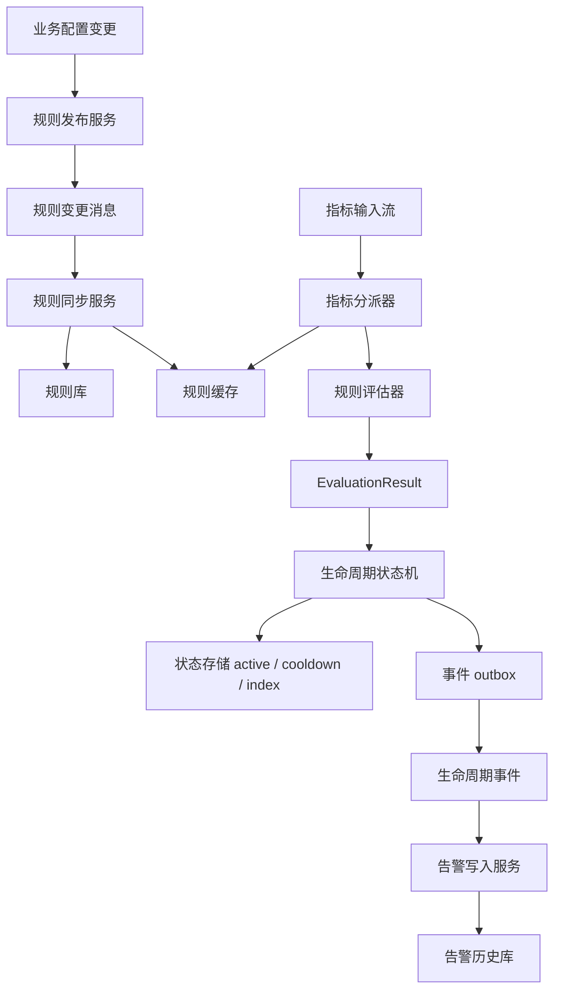
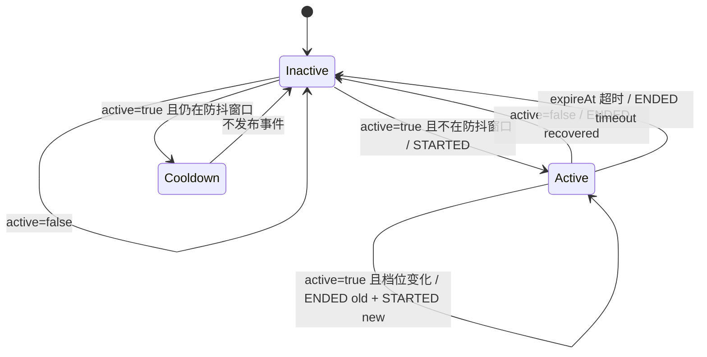
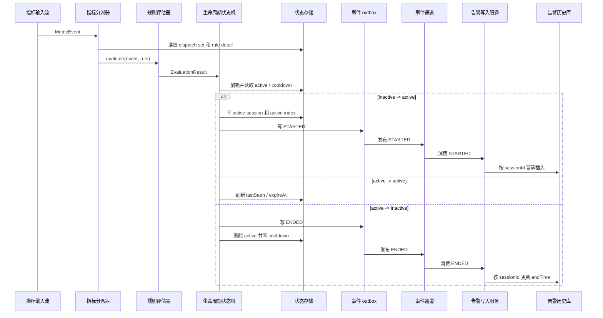

这里的“规则引擎”不是完整 DSL，也不是把表达式解析器讲一遍。它更关注一个后端系统里经常被低估的问题：当一条规则被连续命中时，系统到底应该什么时候新开告警、什么时候续期、什么时候恢复、什么时候因为超时关闭，以及这些状态变化应该由谁来判断。

如果只是判断一次 `value > threshold`，事情并不复杂。复杂的是指标流会持续进来，规则会变更，事件会重试，服务会重启，下游写库也可能短暂不可用。

## 问题背景

早期链路可以简化成这样：

```text
指标输入流
  -> 告警引擎
     -> 规则评估器
        -> 每条数据都发布 tick
           -> 告警写入服务
              -> 查询最近一条告警
              -> 判断开始 / 续期 / 恢复
              -> 写入历史库
```

这个方案能跑，但问题也明显：

- 告警引擎已经知道当前数据是否触发规则，却不保存状态。
- 每条命中数据都会发送事件，即使告警状态没有变化。
- 写入服务在热路径上查历史库，再判断是新开、续期还是关闭。
- 未来增加更多规则类型时，生命周期判断会散落到多个存储逻辑里。

后面改成了另一种边界：

```text
指标输入流
  -> 告警引擎
     -> 规则评估器
        -> 生命周期状态机
           -> 只发布 STARTED / ENDED
              -> 告警写入服务
                 -> 幂等 insert / update
```

核心变化是把“实时状态判断”收回告警引擎。写入服务只理解生命周期事件，不再理解规则评估过程。

## 总体结构

先看整体流程。



里面有几个角色：

| 角色 | 职责 |
|---|---|
| 规则发布服务 | 把业务配置变更转换为规则变更消息 |
| 规则同步服务 | 消费规则变更，落本地规则库，并刷新规则缓存 |
| 指标分派器 | 按监控对象和设备类型找到适用规则，调用对应 evaluator |
| 规则评估器 | 只判断当前 record 是否触发规则，不处理生命周期 |
| 生命周期状态机 | 根据状态存储中的活跃会话，判断开始、续期、切换、恢复、超时 |
| 告警写入服务 | 消费 `STARTED / ENDED`，按 `sessionId` 幂等写库 |

这个拆法的重点不是模块数量，而是职责边界。Evaluator 不查历史库，写入服务不重新推断规则状态，中间统一交给状态机。

## 规则缓存怎么组织

指标流进来后，第一件事不是直接跑所有规则，而是先找到“这条数据可能命中的规则集合”。

状态存储里可以拆成两个层次：

```text
rule:dispatch:{assetId}:{deviceType} -> Set<ruleKey>
rule:detail:{assetId}:{ruleKey}      -> RuleDetail
```

`dispatch` 负责快速筛选，`detail` 保存规则详情。指标分派器先按 `(assetId, deviceType)` 取出 `ruleKey` 集合，再逐条加载规则详情。

如果详情缓存 miss，可以回源规则库并写回缓存。这个回源不是为了让缓存失效变得无所谓，而是为了避免某个 key 丢失后整条链路直接停掉。真正的规则一致性仍然依赖规则变更事件和启动 warm-up。

如果系统使用消息中间件，规则变更事件可以做成“按 key 保留最新版本”的事件流；如果不用消息中间件，也可以用变更表、版本号或定时拉取来达到同样目的。关键点是新实例启动时先追平规则变更，再启动指标消费，避免指标已经进来但规则缓存还没准备好。

## Evaluator 只输出评估结果

一个 evaluator 只处理当前数据和当前规则，输出统一模型：

```json
{
  "assetId": "asset-001",
  "deviceCode": "device-001",
  "ruleId": "rule-001",
  "ruleKey": "temperature:high",
  "profileKey": "WARNING",
  "active": true,
  "eventTime": 1760000000000,
  "receivedAt": 1760000000500,
  "delaySeconds": 60,
  "metadata": {
    "alarmType": "THRESHOLD",
    "alarmName": "High Temperature Warning",
    "alarmLevel": "L2",
    "objectName": "Main Device",
    "startValueJson": "{\"temperature\":82.5}",
    "ruleSnapshotJson": "{\"operator\":\">\",\"threshold\":80}"
  }
}
```

这里的 `active` 表示“当前 record 是否触发这条告警链”。`profileKey` 用来表达同一条规则下的不同档位，比如预警和正式告警。二态规则可以不填。

以位置类规则为例，评估结果可以这样映射：

| 评估状态 | active | profileKey |
|---|---:|---|
| 安全 | false | 空 |
| 接近边界 | true | WARNING |
| 越界 | true | ALARM |

Evaluator 到这里就结束，不发生命周期事件，不查历史库，也不决定“这是不是一条新的告警”。这些都交给状态机。

## 生命周期状态机

状态机维护的不是“某条指标”，而是一条可独立关闭的告警链。一般可以用：

```text
alarmKey = assetId + ":" + ruleKey
```

状态存储保存几类状态：

```text
active:{assetId}:{ruleKey}       -> 当前活跃会话快照
cooldown:{assetId}:{ruleKey}     -> 最近结束后的防抖窗口
active:index:{assetId}           -> 当前对象的活跃 ruleKey 集合
outbox                           -> 待发布的生命周期事件
```

状态机可以画成这样：



伪代码大概是这样：

```ts
function handle(result: EvaluationResult) {
  const unlock = lock(result.assetId, result.ruleKey);

  try {
    const active = state.findActive(result.assetId, result.ruleKey);

    if (!active && !result.active) {
      return;
    }

    if (!active && result.active) {
      if (state.inCooldown(result.assetId, result.ruleKey, result.receivedAt)) {
        return;
      }
      startSession(result);
      return;
    }

    if (!active || result.eventTime < active.lastSeenTime) {
      return;
    }

    if (result.active && result.profileKey === active.profileKey) {
      refreshSession(active, result);
      return;
    }

    if (result.active) {
      closeSession(active, "STATE_CHANGED");
      startSession(result);
      return;
    }

    closeSession(active, "RECOVERED");
  } finally {
    unlock();
  }
}
```

有几个细节容易踩坑。

一方面，`eventTime` 和 `receivedAt` 要分开。`eventTime` 是上游数据本身的时间，用于告警开始、结束和历史展示；`receivedAt` 是引擎收到数据的时间，更适合用来计算超时和防抖。历史数据补传时，如果拿业务时间去续期，很容易把一条活跃会话误关掉。

另一方面，同一个 `assetId + ruleKey` 必须串行处理。可以用分布式锁、按 key 分区的单线程执行器，或者其他能保证同一规则链顺序执行的方式。否则一条恢复消息和一条触发消息并发进来，状态可能会来回覆盖。

## 为什么只发 STARTED 和 ENDED

如果每次命中都发 tick，下游会收到大量状态不变的消息。写入服务为了判断这些 tick 是否应该续期，又要反查历史库。

改成生命周期事件后，状态不变时只刷新状态存储：

```text
active -> active:
  更新 lastSeenTime
  更新 expireAt
  刷新 active TTL
  不发消息
  不访问写入服务
```

只有边沿变化才发消息：

- `inactive -> active` 发 `STARTED`
- `active -> inactive` 发 `ENDED`
- `WARNING -> ALARM` 这种档位切换，先发旧会话 `ENDED`，再发新会话 `STARTED`
- 超过 `expireAt`，由扫描器显式发 `ENDED`
- 规则被删除，主动关闭对应活跃会话并发 `ENDED`

这样写入服务的逻辑会简单很多：`STARTED` 插入，`ENDED` 更新结束时间。

## 一次触发到落库的时序



这里的 outbox 不限定实现形式，可以是状态存储里的队列、数据库 outbox 表，也可以是其他可靠事件缓冲。状态机改变 active session 后，必须保证生命周期事件最终能发出去。直接改状态后同步发事件，一旦发送失败，就会出现“状态已经变了，但事件没发出去”的风险。

引入 outbox 后，流程变成：

1. 状态机写 active / cooldown。
2. 同步写 outbox。
3. publisher 顺序读取 outbox，发送生命周期事件。
4. 发送成功后删除 outbox 记录。
5. 发送失败保留 outbox，下轮继续重试。

状态机每次处理前也可以先补发 pending outbox，减少积压窗口。

## 写入服务只做幂等落库

写入服务不需要知道规则怎么判定，也不需要查“最近一条同规则告警”来判断生命周期。

`STARTED`：

```text
按 sessionId 查询是否存在
  存在 -> 幂等忽略
  不存在 -> insert
```

`ENDED`：

```text
update alarm_history
set status = "ENDED", end_time = ?
where session_id = ?
  and end_time is null
```

更新 0 行可以按幂等处理。可能是重复 `ENDED`，也可能是 `ENDED` 比 `STARTED` 先到。具体要不要进入失败队列或补偿任务，取决于项目的事件处理策略。至少这部分不应该重新触发规则判断。

## 失败时怎么处理

这套设计里有几个边界不能模糊。

状态存储不可用时，告警引擎不能无状态降级。因为状态机的真相源就是状态存储，降级发事件会制造重复开始、漏恢复和状态错乱。更稳妥的处理是暂停消费或抛出异常，等待状态存储恢复后重放或重新处理。

生命周期事件发送失败时，依赖 outbox 重试。发送失败不能先删除 active，也不能假装成功，否则写入服务永远收不到对应事件。

写入服务不可用时，生命周期事件应保留在事件通道或 outbox 中。服务恢复后继续处理，靠 `sessionId` 幂等写库。

告警引擎重启时，不清空 active session。启动后先恢复规则缓存，再继续扫描 active index，超时的会话由状态机显式发 `ENDED`。这里不要依赖状态 TTL 自动“代表告警结束”，TTL 只能防止垃圾状态长期残留，真正的关闭必须有事件。

## 这套设计适合扩展什么

位置类规则只是一个例子。后续接入阈值、离线、速率变化、组合条件等规则时，可以复用同一套生命周期状态机。

需要新增的是 evaluator：

```text
ThresholdEvaluator -> EvaluationResult
OfflineEvaluator   -> EvaluationResult
SpeedEvaluator     -> EvaluationResult
LocationEvaluator  -> EvaluationResult
```

只要 evaluator 能输出统一的 `active / profileKey / eventTime / metadata`，状态机就可以继续处理开始、续期、防抖、档位切换、恢复和超时。

这也是这次改造最重要的收益。规则怎么判定可以继续扩展，但生命周期不要跟着每种规则重新写一遍。

## 小结

告警系统里最容易被低估的不是规则表达式，而是生命周期。

一个实用的拆法是：

- 规则发布服务只负责把业务配置变成规则事件。
- 规则缓存负责快速找到候选规则。
- Evaluator 只判断当前数据是否触发。
- 生命周期状态机统一处理 active、cooldown、timeout 和 profile switch。
- 写入服务只消费 `STARTED / ENDED`，按 `sessionId` 幂等落库。

这样做以后，热路径少了历史库查询，下游事件量也会下降。更重要的是，后续新增规则类型时，工程复杂度不会继续堆到存储侧。
