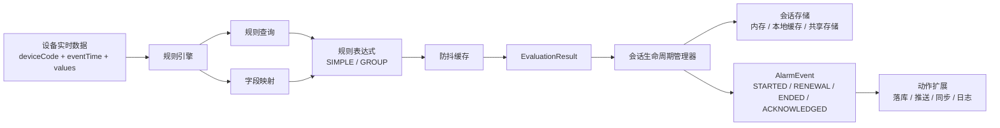
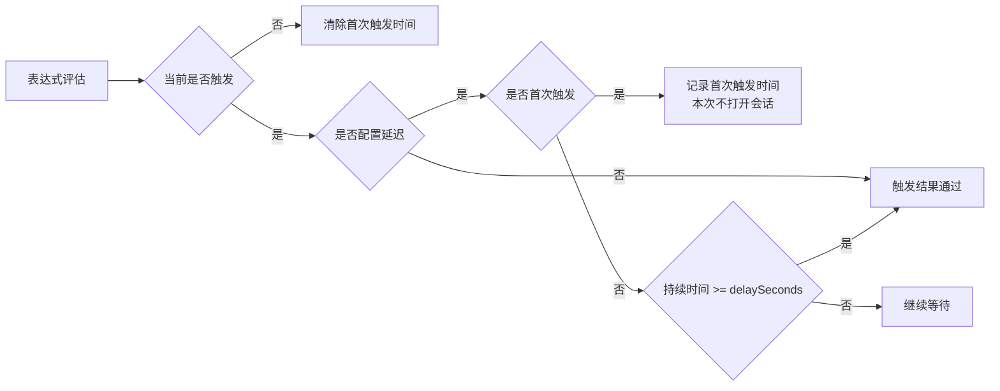
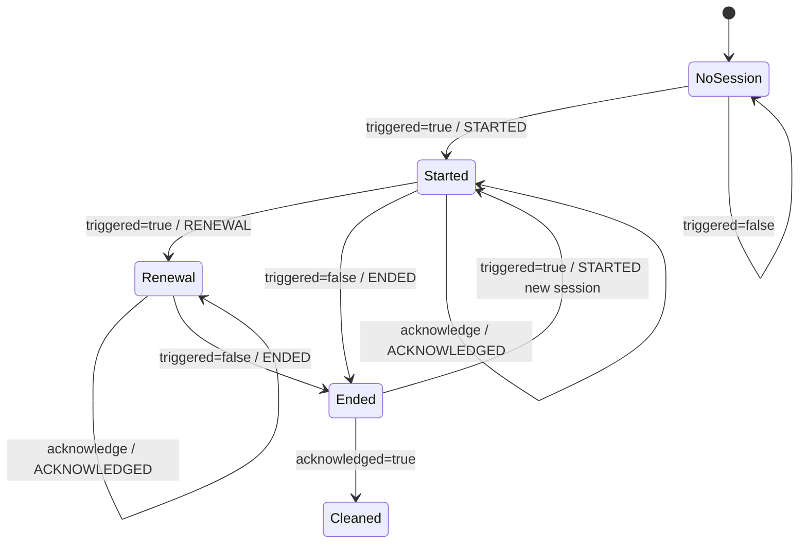
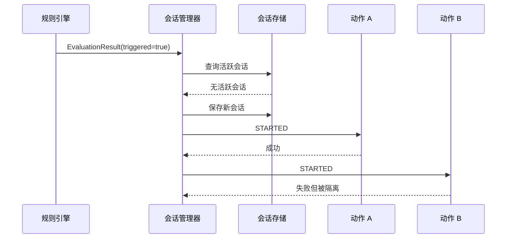

边缘端监控系统里的告警逻辑，表面上看只是判断一个值有没有超过阈值。比如温度大于 80、液位低于 20、某个状态字包含异常码。

真正跑到生产以后，问题会复杂很多：设备数据持续上报，同一条告警不能每秒生成一条新记录；短时间抖动不能立刻打开告警；告警恢复后要有结束事件；人工确认后还要保留一段可查询的会话数据。

所以一个可用的告警规则引擎，不能只是表达式计算器。表达式只回答“当前数据是否触发规则”，会话管理器要把连续的数据点整理成“开始、续报、结束、确认”这些有业务含义的事件。

## 总体结构

这套引擎可以拆成五层：



几个边界很关键：

| 层次 | 职责 |
|---|---|
| 规则查询 | 按设备找到可用规则 |
| 字段映射 | 把规则里的测点标识映射到实时数据字段 |
| 表达式评估 | 判断当前数据是否满足规则 |
| 防抖 | 过滤短时间瞬时异常 |
| 会话生命周期 | 判断开始、续报、结束和确认 |
| 动作扩展 | 处理落库、推送、同步等副作用 |

表达式层和会话层分开以后，规则怎么判断可以继续扩展，告警会话的状态推进不用跟着每种规则重写。

## 对外入口

边缘端业务侧通常只需要一个入口：

```ts
interface RuleEngine {
  evaluateDevice(input: {
    deviceCode: string;
    eventTime: number;
    values: Record<string, unknown>;
  }): void;
}
```

调用方把设备编码、数据实际发生时间和实时值传进来。引擎内部再完成设备查询、规则加载、字段映射、表达式评估、防抖和会话推进。

这里有一个容易踩的点：实时值里的 key 不一定等于规则里配置的测点 ID。更稳的方式是让规则保存“测点标识”，由字段服务映射到真实数据字段，再从 `values` 里取值。这样前端配置、设备协议和实时数据模型可以各自演进，不必把同一个 key 硬绑到底。

## 规则表达式

规则表达式可以先分成两类：单字段表达式和组合表达式。

单字段表达式面向一个测点：

```json
{
  "type": "SIMPLE",
  "fieldKey": "temperature",
  "operator": "GT",
  "value": 80
}
```

常见操作符可以覆盖这些场景：

| 操作符 | 含义 | 适用场景 |
|---|---|---|
| `EQ` | 等于 | 状态字、开关量 |
| `NE` | 不等于 | 状态异常 |
| `GT` / `GTE` | 大于 / 大于等于 | 高限、高高限 |
| `LT` / `LTE` | 小于 / 小于等于 | 低限、低低限 |
| `CONTAINS` | 包含 | 复合状态码、字符串状态 |
| `NOT_CONTAINS` | 不包含 | 反向状态判断 |

组合表达式用来表达多个条件之间的关系：

```json
{
  "type": "GROUP",
  "operator": "AND",
  "conditions": [
    {
      "type": "SIMPLE",
      "fieldKey": "temperature",
      "operator": "GTE",
      "value": 80
    },
    {
      "type": "SIMPLE",
      "fieldKey": "pressure",
      "operator": "LT",
      "value": 2.5
    }
  ]
}
```

`AND` 遇到一个条件不满足就可以短路返回，`OR` 遇到一个条件满足就可以短路返回。这个能力对边缘端很实用，因为很多告警不是单点阈值，而是多个测点组合以后才有意义。

## 防抖

设备采样会有抖动。一个压力值偶尔超过阈值，下一次采样又恢复，如果立刻打开告警，现场页面会出现大量短暂、无意义的告警。

防抖应该放在表达式评估之后、会话生成之前：



防抖逻辑可以简单理解成：

```ts
function debounce(rule: Rule, triggered: boolean, now: number) {
  if (!triggered) {
    debounceStore.remove(rule.key);
    return false;
  }

  if (!rule.delaySeconds || rule.delaySeconds <= 0) {
    return true;
  }

  const firstTriggeredAt = debounceStore.get(rule.key);
  if (!firstTriggeredAt) {
    debounceStore.put(rule.key, now);
    return false;
  }

  return now - firstTriggeredAt >= rule.delaySeconds * 1000;
}
```

这里的关键不是代码怎么写，而是缓存时间要覆盖规则延迟时间。比如某条规则要求连续触发 60 秒才打开告警，但防抖缓存 10 秒就过期，那么首次触发时间会不断丢失，这条规则可能永远无法越过延迟阈值。

## 会话生命周期

表达式和防抖只得到一个布尔结果：当前是否触发。真正的告警系统要维护的是会话。

一条规则在连续异常期间应该只有一个会话。会话里记录开始时间、最后触发时间、结束时间、确认时间、开始值、结束值和规则快照。状态机可以这样看：



处理逻辑可以写成：

```ts
function handleEvaluation(result: EvaluationResult) {
  const session = sessionStore.findByRule(result.ruleId);

  if (result.triggered && (!session || session.endTime)) {
    startSession(result);
    return;
  }

  if (result.triggered && session && !session.endTime) {
    renewSession(session, result);
    return;
  }

  if (!result.triggered && session && !session.endTime) {
    endSession(session, result);
  }
}
```

开始会话时生成 `STARTED` 事件；持续触发时更新 `lastTriggerTime` 并生成 `RENEWAL` 事件；不再触发时写入 `endTime` 并生成 `ENDED` 事件；人工确认时写入 `ackTime` 并生成 `ACKNOWLEDGED` 事件。

`RENEWAL` 事件是否要落库，取决于业务需要。如果历史表只关心最终会话，可以只更新会话状态；如果下游需要知道持续触发过程，可以保留续报事件。无论哪种方式，都不要在持续异常期间重复生成新的开始事件。

## 动作扩展

生命周期事件生成以后，不应该把落库、推送、同步、日志这些副作用都写死在状态机里。

更稳妥的做法是按事件类型提供扩展点：

| 事件 | 可扩展动作 |
|---|---|
| `STARTED` | 保存开始记录、推送实时消息、触发通知 |
| `RENEWAL` | 刷新活跃会话、更新最后触发时间 |
| `ENDED` | 更新结束时间、保存结束值、推送恢复消息 |
| `ACKNOWLEDGED` | 保存确认时间、记录确认备注、清理可关闭会话 |

动作之间可以有优先级。单个动作失败时，应该记录错误，但不要阻断后续动作。告警链路里，一个通知通道失败，不应该影响另一个通道，也不应该让会话状态回滚到未处理。



## 会话存储

边缘端单体系统通常优先考虑简单、稳定和可恢复。会话存储可以按部署形态分三类：

| 存储方式 | 特点 | 适用场景 |
|---|---|---|
| 内存 Map | 简单，无外部依赖，但没有容量和过期控制 | 本地调试、功能验证 |
| 本地缓存 | 支持容量限制和过期，性能好 | 单实例生产运行 |
| 共享存储 | 多实例可共享会话状态，可按设备建立索引 | 主备切换、多实例查询 |

如果边缘端只有一个服务实例，本地缓存通常更合适。它不依赖外部组件，读写直接，故障面小。

如果存在多实例或主备切换，就要考虑共享存储。共享存储里除了保存 `ruleId -> session`，还可以维护 `deviceCode -> ruleId set` 这样的索引，便于页面按设备查询活跃告警。但共享存储不是免费能力：它的可用性会直接影响会话状态，批量查询也要避免全量扫描。

## 生产边界

这类引擎上线后，最值得提前写清楚的是边界，而不是再堆更多规则类型。

第一，字段映射要稳定。规则表达式里的字段标识、设备数据里的字段 key、字段定义里的映射关系必须一致。否则表达式会一直拿不到值，看起来像规则没触发，实际是数据模型不匹配。

第二，防抖缓存的过期时间要覆盖最大延迟规则。长延迟规则需要特别验证，不能只用 1 秒、3 秒这种短延迟样例做测试。

第三，同一规则的会话推进要保证顺序。高频数据或异步评估下，如果两条数据同时看到“没有活跃会话”，就可能重复打开告警。单实例低并发时影响不大，高频或多实例场景下要按规则加锁，或者让共享存储提供原子开始语义。

第四，区间表达式要避免“枚举有了，实现没跟上”。如果暂时没有直接实现 `IN_RANGE`，就用组合表达式表达上下界，避免前端生成一个看似合法、实际永远不触发的规则。

第五，动作失败要可观测。动作失败不应该阻断状态机，但必须有日志、指标或失败队列，否则告警会话看起来正常，实际通知或同步早就断了。

## 小结

边缘端告警规则引擎的重点，不是“能不能判断阈值”，而是把连续采样数据整理成可追踪的告警会话。

一个实用的拆法是：

- 表达式层负责判断当前事实。
- 防抖层负责过滤瞬时抖动。
- 会话层负责开始、续报、结束和确认。
- 存储层按部署形态选择内存、本地缓存或共享存储。
- 动作层处理落库、推送、同步和日志等副作用。

这样做以后，规则可以从硬编码判断变成可配置模型，告警也不再是一堆离散事件，而是一段有开始、有持续、有恢复、有确认的业务会话。
