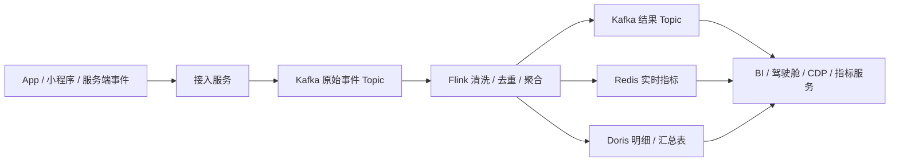
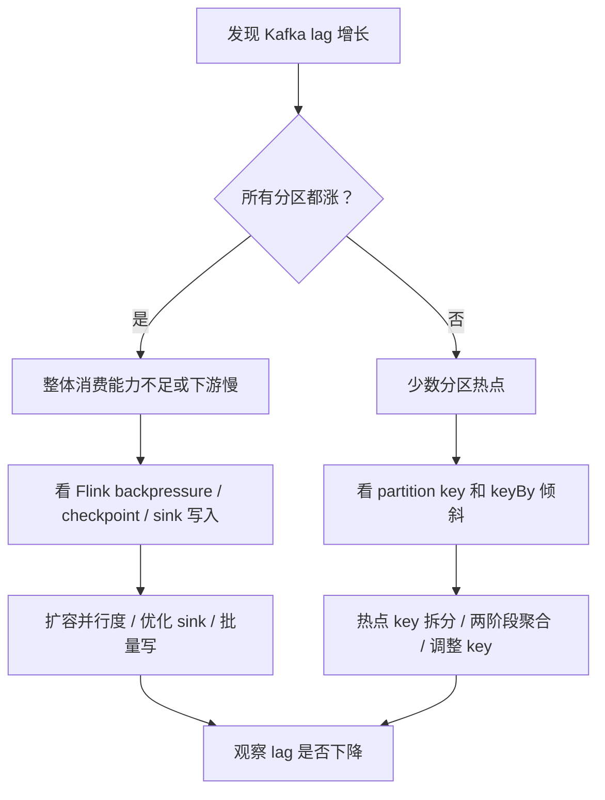
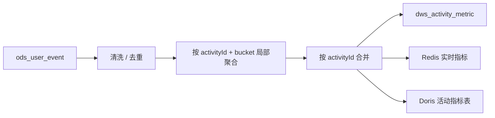

活动上线、优惠券发放、首页弹窗、短时间大量用户下单，这些场景对实时链路很不友好。流量不是慢慢涨上来的，而是在几分钟内把入口、Kafka、Flink、下游存储一起推到高水位。

这篇文章整理一套通用的 Kafka + Flink 方案。场景用咖啡零售业务举例：用户打开活动页、曝光优惠券、点击领取、下单、支付、取消、退款，这些事件进入 Kafka，由 Flink 计算实时指标，再写入 Doris、Redis 或结果 Topic，供驾驶舱、活动看板、CDP 和指标服务查询。

## 先看整体链路

一条典型实时链路可以拆成五层。



接入服务只做轻逻辑：鉴权、限流、字段校验、补公共字段、写 Kafka。复杂清洗、维表关联、窗口聚合、状态计算交给 Flink。下游查询服务不要直接消费原始埋点，应该查询已经清洗或聚合后的结果。

一条消息最好从入口开始就带稳定身份：

```json
{
  "eventId": "evt-20260610-000001",
  "eventName": "coupon_click",
  "eventTime": 1781085600000,
  "userId": "u10001",
  "deviceId": "d90001",
  "activityId": "summer-coffee",
  "couponId": "c202606",
  "shopId": "s厦门001",
  "channel": "app_home"
}
```

`eventId` 用来幂等，`eventTime` 用来按业务时间计算，`userId`、`orderId`、`shopId` 这类字段用于分区、聚合和查询。

## Topic 不要一股脑塞一个

Kafka Topic 的拆分要服务消费和治理。活动埋点、订单事件、支付事件、退款事件都塞进一个 Topic，短期省事，后面会在权限、schema、消费隔离、重放成本上付出代价。

一个可维护的拆法：

| Topic | 数据 | 典型消费者 |
| --- | --- | --- |
| `ods_user_event` | 曝光、点击、浏览、领券等行为事件 | Flink 清洗、ODS 落湖、质量监控 |
| `ods_order_event` | 下单、支付、取消、退款等交易事件 | Flink 指标、订单宽表、对账 |
| `dwd_user_event` | 清洗后的标准用户行为明细 | CDP、AB、行为分析 |
| `dws_activity_metric` | 活动实时指标结果 | 驾驶舱、指标服务 |
| `dead_letter_event` | 解析失败、schema 错误、无法落库的数据 | 补偿任务、人工排查 |

Topic 不必拆到每个事件一个。拆分粒度通常按数据域和治理边界来定：行为、交易、主数据、结果指标、异常数据。

## Kafka 分区数量怎么定

分区数量影响三件事：

- 写入并行度。
- 消费并行度。
- 单个分区内的顺序边界。

一个消费组内，同一个分区只能被一个消费者消费。如果 Topic 只有 12 个分区，这个消费组最多只有 12 个消费者真正工作。你起 20 个消费者，也会有 8 个空闲。

分区数可以按这几个因素估算。

```text
分区数 >= 目标消费者并行度
分区数 >= 峰值写入吞吐 / 单分区可承受写入吞吐
分区数 >= 峰值读取吞吐 / 单消费者可承受读取吞吐
```

实际落地时不要迷信公式，先做压测。单分区能承受多少吞吐和消息大小、压缩、磁盘、网络、Broker 数量都有关系。

一个经验做法：

- 小流量业务从 12 或 24 个分区起步。
- 明显有活动峰值的埋点 Topic，可以从 48 或 96 个分区规划。
- 核心交易 Topic 分区数不要随便改，先看顺序性要求。
- 预估未来一年增长，避免上线两个月就扩分区。

分区不是越多越好。分区越多，Broker 文件句柄、元数据、leader 调度、consumer rebalance 和 checkpoint 状态都会变重。小集群上开几千个分区，很多问题不是吞吐不足，而是协调成本太高。

### 增加分区的副作用

Kafka 可以给 Topic 增加分区，但这不是万能扩容按钮。

几个影响要提前知道：

- 已经写入老分区的数据不会自动重分布。
- 默认 key 分区逻辑会因为分区数变化而改变，同一个 key 未来可能落到新分区。
- 如果严格要求同一 key 长期顺序，扩分区前要评估。
- 旧 lag 集中在老分区时，扩分区对历史积压帮助有限。

严格顺序场景更适合提前规划分区数，或者使用自定义分区策略。普通埋点场景通常不要求全局顺序，扩分区影响可以接受，但仍然要评估 key 分布和消费者状态。

## 分区 key 该选什么

分区 key 的选择决定数据分布，也决定后续处理顺序。

咖啡零售业务里可以这样选：

| 场景 | 推荐 key | 原因 |
| --- | --- | --- |
| 用户行为事件 | `userId` 或 `deviceId` | 同一用户行为顺序更稳定，方便会话和漏斗分析 |
| 订单状态事件 | `orderId` | 同一订单的创建、支付、取消需要有序 |
| 门店实时指标 | `shopId` | 同一门店聚合在一个维度 |
| 商品实时指标 | `skuId` | 按商品统计销量、转化 |
| 活动实时指标 | 不建议只用 `activityId` | 活动数量少，容易热点 |

不要用低基数字段做 key，比如：

- `eventType`
- `platform`
- `appVersion`
- `city`
- `activityId`

这些字段取值少，很容易让少数分区吃掉大部分数据。

活动大促是典型热点。所有用户都访问同一个 `activityId`，如果直接 `keyBy(activityId)`，Flink 里也会形成一个超级热点。更好的做法是两阶段聚合：

```text
第一阶段 key = activityId + hash(userId) % 64
第二阶段 key = activityId
```

第一阶段先把同一个活动拆成 64 个局部聚合，第二阶段再合并结果。这样能把 CPU、state、checkpoint 压力摊开。

## Producer 参数怎么配

入口服务的目标是稳定写入 Kafka，不要在请求线程里做复杂计算。

常见参数方向：

| 参数 | 建议 | 原因 |
| --- | --- | --- |
| `acks` | 核心数据用 `all` | 等待 ISR 副本确认，减少丢消息风险 |
| `enable.idempotence` | 建议开启 | 降低生产者重试导致的重复 |
| `compression.type` | `lz4` 或 `zstd` | 降低网络和磁盘压力 |
| `batch.size` | 按消息大小压测 | 批量越大吞吐越好，但延迟会升高 |
| `linger.ms` | 5 到 50 ms 常见 | 等待更多消息组成批次 |
| `buffer.memory` | 根据峰值写入调大 | 防止短峰值下本地缓冲太小 |
| `retries` | 开启并配合超时 | 网络抖动时自动重试 |

交易事实类事件，比如支付成功、退款成功，优先保证可靠性。曝光、浏览这类行为事件可以接受更高吞吐和更低成本，但也要有采样、限流和丢弃策略的业务授权，不能由技术私自丢。

## 消费者数量为什么不能大于分区数

这里说的是同一个 consumer group。

如果一个 Topic 有 24 个分区，一个 consumer group 里最多 24 个消费者实例能分到分区。第 25 个消费者不会消费任何数据。

```text
Topic partitions = 24
Consumer instances in same group = 32
Active consumers = 24
Idle consumers = 8
```

多出来的消费者不仅没用，还会增加心跳、rebalance 和运维成本。

多个 consumer group 之间互不影响。比如同一个 `ods_user_event` Topic 可以同时被三个组消费：

- Flink 实时指标组。
- ODS 落湖组。
- 数据质量监控组。

每个组都能完整消费 Topic，只是组内消费者数量受分区数限制。

## Flink 并行度怎么定

Flink 并行度要看算子类型，不是全局一个数字走到底。

### Source 并行度

Kafka Source 并行度通常不需要超过 Topic 分区数。分区数是 48，Source 并行度设置成 96，多出来的并行子任务也分不到分区。

常见做法：

```text
Kafka partitions = 48
Flink source parallelism = 48
```

如果后续算子更重，可以在 `rebalance`、`keyBy` 或下游算子上设置更高并行度，但要确认数据分布和状态成本。

### 计算算子并行度

清洗、解析、过滤一般是 CPU 和序列化开销，按机器 CPU 和吞吐压测设置。窗口聚合、状态计算要看 key 数量、state 大小和 checkpoint 时间。

可以按这几个指标观察：

- 每个 subtask 的 records in / out 是否均衡。
- busy time 是否接近 100%。
- backpressure 是否持续出现。
- checkpoint alignment 和 state size 是否异常。
- Kafka lag 是否随时间持续增长。

如果只有少数 subtask 很忙，大概率不是并行度不够，而是 key 倾斜。

### Sink 并行度

Sink 经常是瓶颈。写 Doris、MySQL、Redis、外部 HTTP 接口，都可能拖慢整条链路。

处理方式：

- 批量写。
- 异步写。
- 控制单批大小。
- 控制并发连接数。
- 慢 sink 单独拆链路。
- 结果先写 Kafka，再由专门落库服务消费。

不要让一个慢查询库拖住主计算链路。

## keyBy 应该按什么字段

`keyBy` 只应该按计算状态需要的维度来选。

几个例子：

| 目标 | keyBy 字段 | 说明 |
| --- | --- | --- |
| 用户会话、用户转化 | `userId` | 同一用户状态放在一起 |
| 订单状态机 | `orderId` | 同一订单事件有序 |
| 门店实时订单数 | `shopId` | 同一门店聚合 |
| 商品实时销量 | `skuId` | 同一商品聚合 |
| 活动实时指标 | `activityId + 分片` | 避免单活动热点 |

`keyBy` 的两个底线：

- 业务语义要对，状态不能被拆错。
- key 分布要尽量均匀，不能让少数 key 压垮 subtask。

比如“统计某个活动实时曝光人数”，直接按 `activityId` 分流会热点，因为一场活动可能占据大部分流量。可以先按 `activityId + bucket` 做局部聚合，每隔几秒输出中间结果，再按 `activityId` 合并。

## Checkpoint 怎么配

有状态 Flink 作业必须认真配置 Checkpoint。没有 Checkpoint，state 丢失后只能靠重放和业务补偿，报警、窗口、去重、标签状态都可能出错。

一组常见起步参数：

```java
env.enableCheckpointing(60_000);

CheckpointConfig config = env.getCheckpointConfig();
config.setCheckpointingMode(CheckpointingMode.EXACTLY_ONCE);
config.setMinPauseBetweenCheckpoints(30_000);
config.setCheckpointTimeout(10 * 60_000);
config.setMaxConcurrentCheckpoints(1);
config.setTolerableCheckpointFailureNumber(3);
config.enableExternalizedCheckpoints(
    CheckpointConfig.ExternalizedCheckpointCleanup.RETAIN_ON_CANCELLATION
);
```

这些参数背后的含义：

| 参数 | 常见起步值 | 作用 |
| --- | --- | --- |
| checkpoint interval | 30 秒到 5 分钟 | 状态快照频率 |
| timeout | 5 到 10 分钟 | 避免大状态下误判失败 |
| min pause | 10 到 60 秒 | 避免 checkpoint 一个接一个压垮作业 |
| max concurrent | 1 | 大多数业务先避免并发 checkpoint |
| mode | `EXACTLY_ONCE` | 保证 Flink 内部状态一致恢复 |
| externalized | 开启 | 作业取消后保留恢复点 |

Checkpoint 间隔不是越短越好。间隔太短会增加 IO、网络和状态后端压力。间隔太长，故障恢复时要重放更多 Kafka 数据。实时看板类任务可以 30 到 60 秒起步；大状态标签任务可以 2 到 5 分钟起步，再看恢复时间和资源压力。

### RocksDB 和增量 Checkpoint

用户标签、窗口去重、活动状态这类场景 state 会变大，内存状态后端容易顶住堆内存。RocksDB State Backend 更适合大 state。

建议：

- 大 state 作业使用 RocksDB。
- 开启增量 checkpoint。
- 给 state 设置 TTL。
- 监控本地磁盘、checkpoint 大小、checkpoint 时长。

状态 TTL 很重要。比如去重状态只需要保留 24 小时，就不要长期保存。用户会话状态如果 30 分钟没有新事件，也应该过期。

### Unaligned Checkpoint 什么时候用

链路有持续 backpressure 时，普通 checkpoint 可能因为 barrier 对齐变慢。Unaligned Checkpoint 可以缓解对齐等待，把缓冲中的数据也纳入 checkpoint。

它不是常规优化开关。先排查 sink、热点 key、state 和资源，再考虑开启。否则只是把压力换一种形式保存下来。

## 突发流量时怎么处理

流量激增时先定位压力在哪里。



### 先看 Kafka lag

Lag 要按 consumer group、Topic、partition 三个维度看。

- 所有 partition lag 都涨，通常是整体消费能力不足。
- 少数 partition lag 涨，通常是生产 key 或 Flink keyBy 倾斜。
- 多个 consumer group 都涨，可能是生产流量暴涨或 Broker 压力。
- 只有一个 group 涨，通常是这个消费链路或下游慢。

### 再看 Flink UI

重点看：

- 哪个 operator backpressured。
- 哪些 subtask busy 高。
- checkpoint 是否变慢。
- checkpoint size 是否突然变大。
- source records in 和 sink records out 是否差距越来越大。
- 是否频繁重启或 rebalance。

如果 sink 慢，增加 source 并行度没有意义。数据只会更快堆到下游。

### 最后看下游

常见下游瓶颈：

- Doris 导入慢。
- Redis pipeline 太小或连接数不足。
- MySQL 单条写入太多。
- HTTP 维表接口慢。
- 外部服务限流。
- 大量同步 RPC 阻塞。

实时链路里的同步外部调用要尽量少。维表可以缓存、广播或异步 IO，慢接口不要放在主链路中间。

## 短期止血方案

活动已经开始，lag 持续上涨时，先止血。

可以做：

- 扩 Flink TaskManager 和算子并行度。
- 如果消费者数量小于分区数，扩消费者。
- 提高 sink 批量写入大小。
- 非核心结果流临时降级或延迟处理。
- 脏数据进入死信，不要卡住主链路。
- 拉长 Kafka retention，避免还没处理完就过期。
- 慢 sink 拆到结果 Topic 后异步落库。
- 对大屏只保留最近实时指标，历史补算放到离线任务。

谨慎做：

- 临时跳 offset。
- 直接丢数据。
- 强行关闭 checkpoint。
- 临时增加大量分区。
- 让入口服务绕过 Kafka 直写数据库。

跳 offset 和丢数据需要业务确认。技术上能做，不代表应该做。

## 长期治理方案

长期看，突发流量不是靠现场手工操作解决的。

需要把下面这些能力提前建好：

- 容量压测，拿到单分区、单 consumer、单 sink 的真实吞吐。
- Topic 分层，原始、清洗、结果、死信分开。
- 关键事件有 eventId，消费者幂等。
- 低基数 key 做热点拆分。
- 大活动指标做两阶段聚合。
- Kafka lag、Flink backpressure、checkpoint、sink 写入耗时接入监控。
- 结果对账，入口量、消费量、落库量、失败量能对齐。
- 非核心链路可降级。
- 重要活动前预扩容，活动后再缩容。

一套成熟的实时链路，应该能回答三个问题：

- 现在压力在哪一段。
- 哪些数据可以延迟，哪些不能丢。
- 事故结束后怎么证明数据补齐了。

## 用咖啡活动举个完整例子

假设一个“9.9 元咖啡券”活动上线，首页曝光和领券瞬间放量。

### Topic 设计

```text
ods_user_event
ods_order_event
dwd_user_event
dws_activity_metric
dead_letter_event
```

### Kafka key

| 事件 | key |
| --- | --- |
| 活动页曝光 | `userId` |
| 优惠券点击 | `userId` |
| 优惠券领取成功 | `userId` |
| 订单创建 | `orderId` |
| 支付成功 | `orderId` |
| 门店出杯 | `shopId` |

活动实时大盘不要直接按 `activityId` 单 key 聚合。先按：

```text
activityId + hash(userId) % 64
```

做局部统计，再合并成活动总曝光、点击、领取、下单、支付。

### Flink 作业

一条实时活动指标链路可以这样拆：



关键状态：

- eventId 去重状态。
- 窗口聚合状态。
- 活动维表缓存。
- 用户分桶状态，通常可由 hash 计算，不一定存 state。

### 指标输出

可以输出：

```text
activity_id
window_start
window_end
exposure_uv
click_uv
coupon_receive_uv
order_uv
pay_uv
gmv
click_rate
pay_conversion_rate
```

写入时用唯一键保证幂等：

```text
activity_id + window_start + window_end
```

如果窗口会因为迟到数据更新，sink 要支持 upsert 或覆盖写。

## 常见误区

### 误区一：消费者越多越快

同一个 consumer group 内，消费者数量超过分区数就会空闲。增加消费者前先看分区数、分区 lag 和下游处理能力。

### 误区二：分区越多越安全

分区多会增加 Broker、Consumer、Flink Source、Checkpoint 的成本。没有吞吐压测和规划，盲目开大分区会让系统更难维护。

### 误区三：只看 Kafka lag

Lag 是结果，不是原因。Flink backpressure、checkpoint 变慢、sink 写入慢、key 倾斜都会表现成 lag。

### 误区四：Flink 开了 Checkpoint 就端到端 exactly-once

Flink 内部状态可以一致恢复，端到端还要看 sink。写数据库、Doris、Redis 时通常要靠唯一键、upsert、事务写或幂等逻辑。

### 误区五：所有指标都实时算

实时指标适合驾驶舱和活动过程监控。最终经营口径、复购、长期标签、退款修正后的指标，通常还要离线任务重新计算。

## 配置检查清单

### Kafka

- Topic 是否按数据域拆分。
- 分区数是否覆盖目标消费者并行度。
- 分区 key 是否高基数、分布均匀。
- 核心数据是否 `acks=all`。
- Producer 是否开启幂等。
- 是否启用压缩。
- retention 是否覆盖最长恢复时间。
- 是否有死信 Topic。
- 是否监控 partition 级 lag。

### Flink

- Source 并行度是否和 Kafka 分区匹配。
- keyBy 是否符合业务状态维度。
- 是否存在低基数热点 key。
- 大状态是否使用 RocksDB。
- 是否开启增量 checkpoint。
- checkpoint interval、timeout、min pause 是否合理。
- sink 是否批量、异步、幂等。
- 是否监控 backpressure、busy time、checkpoint size、checkpoint duration。

### 下游

- Redis 是否使用 pipeline 或批量写。
- Doris 是否按合适分区分桶写入。
- 数据库是否有唯一键支撑 upsert。
- 查询服务是否有缓存和限流。
- 是否有入口量、消费量、落库量、失败量对账。

## 收尾

Kafka 和 Flink 的参数没有固定答案。分区数、消费者数量、Flink 并行度、keyBy、Checkpoint 间隔，都要回到业务问题：流量峰值是多少，是否要求顺序，状态按什么维度维护，下游能写多快，故障后允许重放多久。

面对突发流量，最怕一边堆积一边盲目扩容。先定位是全局吞吐不足、局部热点、Flink 反压，还是下游写入慢，再决定扩分区、扩并行度、拆热点 key、优化 sink 或做降级。能定位，能补偿，能对账，这条实时链路才算可控。
