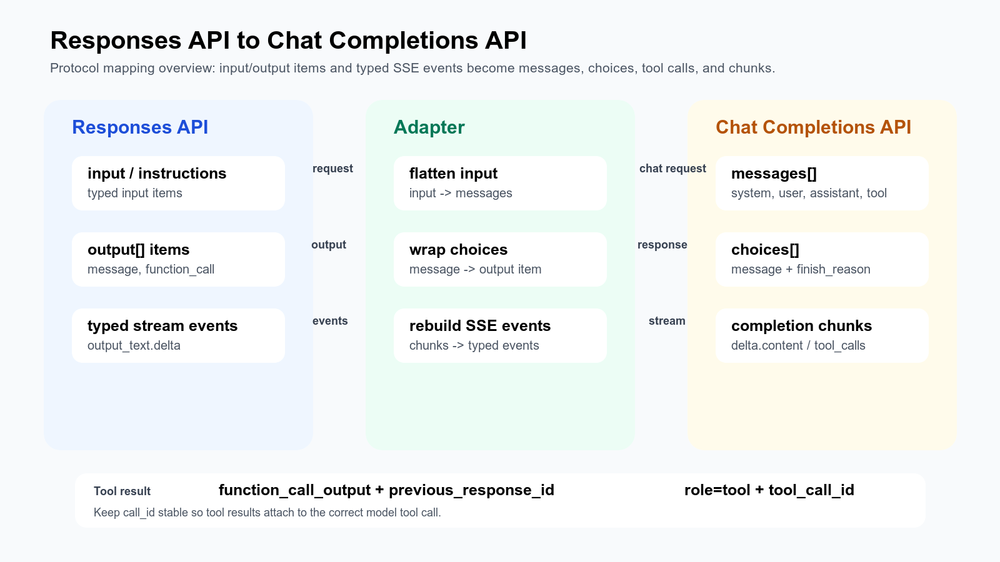

## 背景

OpenAI 同时提供 Responses API 和 Chat Completions API。Chat Completions 以 `messages` 会话数组为核心；Responses API 以 `input`、结构化 output item、工具和流式事件为核心，更适合 agent 工作流、工具调用、多模态输入和统一状态表达。

:::info[概要]
两者都能完成文本生成和工具调用，但协议重心不同：Chat Completions 是“消息数组 -> choices”；Responses API 是“输入项 -> 结构化 response output + typed stream events”。
:::

## 一图看懂



## 请求入参对比

| 含义 | Responses API `/responses` | Chat Completions `/chat/completions` | 迁移/适配方式 |
|---|---|---|---|
| Endpoint | `POST /responses` | `POST /chat/completions` | 改 URL |
| 模型 | `model` | `model` | 通常原样传 |
| 主要输入 | `input`，可为字符串或 input item 数组 | `messages` 数组 | `input` 展平成 `messages` |
| 顶层指令 | `instructions` | 无完全等价顶层字段 | 转成 `developer` 或 `system` message |
| 消息角色 | `user`、`assistant`、`system`、`developer` | `user`、`assistant`、`system`、`developer`、`tool` | 大体可映射 |
| 文本内容 | `content: [{ type: "input_text", text }]` | `content: "text"` 或 content part 数组 | 抽取或保留文本 part |
| 图片/文件输入 | `input_image`、`input_file` 等 input content item | 视模型和接口支持情况而定 | 不能无损转成纯文本 Chat 格式 |
| 最大输出 | `max_output_tokens` | `max_completion_tokens`，旧实现常见 `max_tokens` | 改字段名 |
| 流式 | `stream: true` | `stream: true` | 原样传，但输出事件不同 |
| 工具定义 | `tools[]` | `tools[]` | 工具结构需要转换 |
| 工具选择 | `tool_choice` | `tool_choice` | 简单值可映射，复杂约束需单独处理 |

### Responses 请求示例

```json
{
  "model": "gpt-5.5",
  "instructions": "You are a helpful assistant.",
  "input": [
    {
      "type": "message",
      "role": "user",
      "content": [
        { "type": "input_text", "text": "What is the weather in Hangzhou?" }
      ]
    }
  ],
  "stream": true,
  "max_output_tokens": 1024
}
```

### Chat Completions 请求示例

```json
{
  "model": "gpt-5.5",
  "messages": [
    { "role": "developer", "content": "You are a helpful assistant." },
    { "role": "user", "content": "What is the weather in Hangzhou?" }
  ],
  "stream": true,
  "max_completion_tokens": 1024
}
```

## 普通输出对比

| 含义 | Responses API | Chat Completions | 迁移/适配方式 |
|---|---|---|---|
| 顶层对象 | `response` | `chat.completion` | 重包 |
| 输出列表 | `output[]` | `choices[]` | `choices[0].message` 转成 `output[0]` |
| 文本位置 | `output[].content[].text` | `choices[].message.content` | 包成 `output_text` content item |
| 工具调用位置 | `output[]` 中的 `function_call` item | `choices[].message.tool_calls[]` | 转换 item 结构 |
| 完成状态 | `status: "completed"` | `finish_reason: "stop"` 等 | 根据 finish reason 推导 status |
| 用量 | `usage.input_tokens`、`usage.output_tokens` | `usage.prompt_tokens`、`usage.completion_tokens` | 字段改名 |

### Responses 输出示例

```json
{
  "id": "resp_123",
  "object": "response",
  "status": "completed",
  "model": "gpt-5.5",
  "output": [
    {
      "id": "msg_123",
      "type": "message",
      "role": "assistant",
      "status": "completed",
      "content": [
        { "type": "output_text", "text": "It is sunny.", "annotations": [] }
      ]
    }
  ],
  "usage": {
    "input_tokens": 20,
    "output_tokens": 4,
    "total_tokens": 24
  }
}
```

### Chat Completions 输出示例

```json
{
  "id": "chatcmpl_123",
  "object": "chat.completion",
  "model": "gpt-5.5",
  "choices": [
    {
      "index": 0,
      "message": {
        "role": "assistant",
        "content": "It is sunny."
      },
      "finish_reason": "stop"
    }
  ],
  "usage": {
    "prompt_tokens": 20,
    "completion_tokens": 4,
    "total_tokens": 24
  }
}
```

## 流式输出对比

| 含义 | Responses API | Chat Completions |
|---|---|---|
| 协议 | Server-Sent Events typed events | Server-Sent Events data chunks |
| 开始事件 | `response.created`、`response.in_progress` | 首个 `chat.completion.chunk` |
| 文本增量 | `response.output_text.delta` | `choices[0].delta.content` |
| 工具参数增量 | `response.function_call_arguments.delta` | `choices[0].delta.tool_calls[].function.arguments` |
| 文本结束 | `response.output_text.done` | 通常没有独立文本 done 事件 |
| item 结束 | `response.output_item.done` | 通常通过 `finish_reason` 表达 |
| 响应结束 | `response.completed` | `data: [DONE]` |

Chat Completions 流式 chunk：

```text
data: {"object":"chat.completion.chunk","choices":[{"delta":{"content":"It"}}]}

data: {"object":"chat.completion.chunk","choices":[{"delta":{"content":" is sunny."},"finish_reason":"stop"}]}

data: [DONE]
```

等价 Responses 流式事件：

```text
event: response.created
data: {"type":"response.created","response":{"status":"in_progress"}}

event: response.output_item.added
data: {"type":"response.output_item.added","item":{"type":"message","status":"in_progress"}}

event: response.output_text.delta
data: {"type":"response.output_text.delta","delta":"It","output_index":0,"content_index":0}

event: response.output_text.delta
data: {"type":"response.output_text.delta","delta":" is sunny.","output_index":0,"content_index":0}

event: response.output_text.done
data: {"type":"response.output_text.done","text":"It is sunny."}

event: response.output_item.done
data: {"type":"response.output_item.done","item":{"type":"message","status":"completed"}}

event: response.completed
data: {"type":"response.completed","response":{"status":"completed","output":[...]}}
```

## Tool Call 定义对比

Responses API 的 function tool 定义较扁平：

```json
{
  "tools": [
    {
      "type": "function",
      "name": "get_weather",
      "description": "Get current weather for a city",
      "parameters": {
        "type": "object",
        "properties": {
          "city": { "type": "string" }
        },
        "required": ["city"]
      },
      "strict": true
    }
  ],
  "tool_choice": "auto"
}
```

Chat Completions 的 function tool 定义多一层 `function`：

```json
{
  "tools": [
    {
      "type": "function",
      "function": {
        "name": "get_weather",
        "description": "Get current weather for a city",
        "parameters": {
          "type": "object",
          "properties": {
            "city": { "type": "string" }
          },
          "required": ["city"]
        }
      }
    }
  ],
  "tool_choice": "auto"
}
```

转换规则：

```text
Responses tool.name        -> Chat tool.function.name
Responses tool.description -> Chat tool.function.description
Responses tool.parameters  -> Chat tool.function.parameters
Responses tool.strict      -> Chat tool.function.strict
```

## Tool Call 输出对比

Responses API 的模型工具调用输出是 `output[]` 里的 `function_call` item：

```json
{
  "output": [
    {
      "type": "function_call",
      "id": "fc_123",
      "call_id": "call_123",
      "name": "get_weather",
      "arguments": "{\"city\":\"Hangzhou\"}",
      "status": "completed"
    }
  ]
}
```

Chat Completions 的模型工具调用输出在 assistant message 的 `tool_calls[]`：

```json
{
  "choices": [
    {
      "message": {
        "role": "assistant",
        "content": null,
        "tool_calls": [
          {
            "id": "call_123",
            "type": "function",
            "function": {
              "name": "get_weather",
              "arguments": "{\"city\":\"Hangzhou\"}"
            }
          }
        ]
      },
      "finish_reason": "tool_calls"
    }
  ]
}
```

流式工具调用时，Chat Completions 可能逐段返回 arguments：

```json
{
  "choices": [
    {
      "delta": {
        "tool_calls": [
          {
            "index": 0,
            "id": "call_123",
            "type": "function",
            "function": {
              "name": "get_weather",
              "arguments": "{\"city"
            }
          }
        ]
      }
    }
  ]
}
```

Responses API 需要表达为 typed events：

```text
event: response.output_item.added
data: {"type":"response.output_item.added","item":{"type":"function_call","call_id":"call_123","name":"get_weather","arguments":""}}

event: response.function_call_arguments.delta
data: {"type":"response.function_call_arguments.delta","delta":"{\"city"}

event: response.function_call_arguments.done
data: {"type":"response.function_call_arguments.done","arguments":"{\"city\":\"Hangzhou\"}"}

event: response.output_item.done
data: {"type":"response.output_item.done","item":{"type":"function_call","status":"completed"}}
```

## Tool Result 回传对比

Responses API 下一轮输入：

```json
{
  "input": [
    {
      "type": "function_call_output",
      "call_id": "call_123",
      "output": "Sunny, 27C"
    }
  ]
}
```

Chat Completions 下一轮消息：

```json
{
  "messages": [
    {
      "role": "assistant",
      "content": null,
      "tool_calls": [
        {
          "id": "call_123",
          "type": "function",
          "function": {
            "name": "get_weather",
            "arguments": "{\"city\":\"Hangzhou\"}"
          }
        }
      ]
    },
    {
      "role": "tool",
      "tool_call_id": "call_123",
      "content": "Sunny, 27C"
    }
  ]
}
```

转换规则：

```text
Responses function_call_output.call_id -> Chat tool_call_id
Responses function_call_output.output  -> Chat tool message content
Responses 上一轮 function_call item     -> Chat assistant message tool_calls[]
```

Responses API 在无状态调用里通常需要同时带上上一轮 `previous_response_id`，让模型知道这个工具结果属于哪一次响应：

```json
{
  "previous_response_id": "resp_123",
  "input": [
    {
      "type": "function_call_output",
      "call_id": "call_123",
      "output": "Sunny, 27C"
    }
  ]
}
```

## 转换实现要点

1. 请求侧：把 Responses 的 `instructions` 转成 Chat 的 `developer` 或 `system` message。
2. 请求侧：把 Responses 的 `input` item 展平成 Chat 的 `messages`。
3. 请求侧：把 Responses 的 function tool 从扁平结构转成 `tools[].function`。
4. 响应侧：把 Chat 的 `choices[0].message.content` 包成 Responses 的 `output[].content[].text`。
5. 流式侧：把 Chat 的 `delta.content` 补成 `response.output_text.delta` 等生命周期事件。
6. 工具侧：累计 Chat 的 `delta.tool_calls[].function.arguments`，最终补出 `response.function_call_arguments.done` 和 `response.output_item.done`。

## 不能无损转换的部分

- Responses API 的内置工具、MCP 工具、文件输入、图片输入、reasoning item 等结构，比 Chat Completions 更丰富。
- Chat Completions 的 `messages` 更适合传统对话历史；Responses API 的 `output[]`、`previous_response_id`、conversation state 更适合表达 agent 过程中的多种 output item 和跨轮状态。
- 流式 Responses 有完整生命周期事件；Chat Completions chunk 更轻量，适配时需要自行补状态。

## 官方文档

- [OpenAI Responses API - Create a response](https://developers.openai.com/api/reference/resources/responses/methods/create/)
- [OpenAI Responses API - Streaming events](https://developers.openai.com/api/reference/resources/responses/streaming-events/)
- [OpenAI Chat Completions API - Create chat completion](https://developers.openai.com/api/reference/resources/chat/subresources/completions/methods/create/)
- [OpenAI Chat Completions API - Streaming events](https://developers.openai.com/api/reference/resources/chat/subresources/completions/streaming-events/)
- [OpenAI Function calling](https://developers.openai.com/api/docs/guides/function-calling)
- [OpenAI Chat Completions vs Responses](https://developers.openai.com/api/docs/guides/responses-vs-chat-completions)
