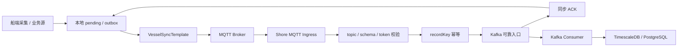
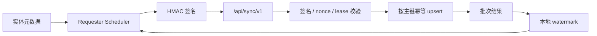

前面整理过一套基于 MQTT 的可靠同步模型，重点是 ACK、pending、watermark、幂等和最终对账。最近把船岸同步 demo 继续往工程实现推进后，一个边界变得更清楚：船岸同步不应该只有一条协议链路。

同样是“同步”，高频遥测、schema、报警会话和固定业务表面对的是不同问题。前者更像弱网下的可靠流：数据会持续产生，可能断网、重放、乱序、主备切换，还要在岸端证明连续完整。后者更像业务表复制：数据结构稳定，按主键 upsert，按水位增量扫描，并且常常需要双向但有方向约束的同步。

所以项目里把同步拆成了两条主线：

| 链路 | 适合的数据 | 核心问题 |
|---|---|---|
| MQTT 可靠流 | schema、设备遥测、报警会话和报警事件 | 弱网、补发、幂等、主备切换、连续水位 |
| HTTP 业务表同步 | 船舶报告、指令、配置、字典、低频业务表 | 主键 upsert、分页水位、鉴权、字段白名单、方向控制 |

这个拆分看起来增加了模块数，但它避免了一个更大的问题：把所有数据都塞进同一种传输协议，然后在协议上不断堆例外。

## 模块边界

当前 demo 的顶层结构按协议先拆开：

```text
vessel-shore-sync-demo
├── mqtt-sync
│   ├── sync-core
│   ├── sync-business-common
│   ├── sync-compression
│   ├── timescaledb-schema-spring-boot-starter
│   ├── vessel-sync-spring-boot-starter
│   ├── shore-sync-spring-boot-starter
│   ├── vessel-sync-demo-app
│   └── shore-sync-demo-app
└── http-sync
    ├── http-sync-api
    ├── http-sync-auth-core
    ├── http-sync-runtime-common
    ├── http-sync-endpoint-spring-boot-starter
    ├── http-sync-requester-spring-boot-starter
    ├── vessel-http-sync-demo-app
    └── shore-http-sync-demo-app
```

`sync-core` 只放 envelope、header、ACK、topic、codec 和校验逻辑，不放 Spring，也不放具体报警业务。报警会话这类船岸共用 payload 放到 `sync-business-common`。指标压缩放到 `sync-compression`，它负责把 `Map<fieldKey, value>` 按 schema 压成 `Map<index, value>`，再在岸端解回字段 key。

这条边界很重要。协议层应该回答“消息怎么识别、校验、确认和重放”，业务层才回答“报警会话怎么 upsert，遥测最终写到哪张表”。

## MQTT 链路

MQTT 这边的目标不是“能发到岸端”，而是“断网、重启、重复投递、主备切换以后还能证明补齐”。



船端 starter 暴露 `VesselSyncTemplate`，负责发布 schema、telemetry 和 alarm session，并消费岸端 ACK。岸端 starter 订阅 schema、metric、alarm topic，完成 topic 和 body 一致性校验、schema 校验、幂等判断，再把校验通过后的消息交给业务 handler。

现在 demo 里 telemetry 和 alarm 的 handler 不是直接写业务库，而是先写 Kafka。Kafka send 成功后，shore starter 才返回同步 ACK；后续由 Kafka consumer 批量落库。

这让 ACK 的语义更精确：

- ACK 表示岸端可靠入口已经接管，或者确认这是重复消息。
- ACK 不表示最终业务表已经追平。
- 最终一致性还要看 Kafka consumer lag、死信、pending、watermark 和业务表对账。

如果 ACK 早于 Kafka send，就会出现“船端清了 pending，但岸端可靠入口没有接住”的漏洞。如果 ACK 等到最终业务库落库，又会把同步入口和下游消费强耦合，吞吐和故障隔离都会变差。当前边界是一个折中：入口接管后确认，下游追平另行验收。

## Topic 和 Envelope

业务 topic 保持稳定：

```text
v1/{imo}/{source}/schema
v1/{imo}/{source}/metric/{deviceCode}
v1/{imo}/{source}/alarm
v1/{imo}/{source}/schema-ack
v1/{imo}/{source}/metric-ack
v1/{imo}/{source}/alarm-ack
```

`imo` 和 `source` 来自 topic、clientId 和 Broker ACL，payload 不再携带一份可被伪造的身份。metric topic 多一段 `deviceCode`，岸端会校验 topic 里的设备和 body 里的设备一致；alarm 保持统一 topic，避免低频报警会话拆出过多 topic。

schema 使用 retained message，因为它代表某个数据源的最新结构。metric 和 alarm 不使用 retained，否则新订阅者上线时可能把 Broker 保留的最后一条业务消息误当成新事件。

消息 envelope 里，`header` 放协议元数据，`body` 放业务数据。可靠流还会在扩展字段里携带 `streamClass`、`recordKey`、`captureSeq` 和 HA 信息。这里有三组 ID 不能混用：

| 字段 | 用途 |
|---|---|
| `messageId` | 传输消息定位和 ACK 对应，每次发布可以变化 |
| `recordKey` | 业务幂等键，同一条真实数据重发时必须稳定 |
| `captureSeq` | 连续水位和 gap 检测 |

只要这三个概念混在一起，重试、补发、主备接力和对账都会变得含糊。

## Schema、压缩和 TimescaleDB

遥测数据如果直接按字段 key 发送，消息会很重。demo 里把 schema 按产品维护，多个设备共享同一组字段定义：

```json
{
  "productCode": "ams_pc",
  "deviceCodes": ["ams_pc_device4", "ams_pc_device5"],
  "fields": [
    { "fieldId": "0", "fieldKey": "AFT-WHC", "dataType": "DOUBLE" },
    { "fieldId": "1", "fieldKey": "FWD-WHC", "dataType": "DOUBLE" }
  ]
}
```

船端发送 telemetry 时只带索引和值：

```json
{
  "deviceCode": "ams_pc_device4",
  "schemaId": "sha256:vessel-schema-demo",
  "schemaVersion": 1,
  "batchId": 1777011493000,
  "seqStart": 1,
  "seqEnd": 1,
  "samples": [
    {
      "0": 12.3,
      "1": 45.6
    }
  ]
}
```

岸端在调用 `TelemetryMessageHandler` 前，用已保存的 `VesselSchema` 解压回 `Map<fieldKey, value>`。如果 schema 缺失，消息不能直接丢，也不能落业务表，只能进入隔离或返回可恢复的拒绝，等 schema 补齐后重放。

TimescaleDB 的表结构维护也拆成了独立 starter。收到 schema 后，岸端可以按产品生成 hypertable：

```text
productCode -> 一个 hypertable
deviceCode  -> hypertable 内的 device_code 列
fieldKey    -> hypertable 内的指标列
```

这个模块不依赖 MQTT 协议。它只关心产品、设备、字段和类型，入口是 `TimescaleSchemaSynchronizer`。这样以后 schema 来源可以是 MQTT，也可以是配置中心或别的控制面。

## 主备发送权

船端主备不能只靠“谁觉得自己是 active”。可靠数据发送权必须有 fencing。

MQTT 方案里，生产设计是岸端 Lease Coordinator 签发 `epoch + leaseId + fencingToken`。每条可靠消息携带当前发送权，岸端入口校验 token；旧 token 消息返回 `STALE_FENCING_TOKEN`，不会进入可靠入口。

demo 里用共享 PostgreSQL 表模拟主备状态：

| 表 | 作用 |
|---|---|
| `demo_ha_lease` | 当前 owner、epoch、leaseId、fencingToken 和过期时间 |
| `demo_ha_heartbeat` | 每个节点的存储可写、发送健康和角色状态 |
| `demo_ha_node_control` | 测试时手工控制节点健康 |

standby 可以继续采集并写共享 outbox，但没有 lease 时不能发送。primary 异常后，standby 获得新 epoch 和 token，继续发送未确认的 pending。旧 primary 恢复后，如果还拿旧 token 发送，岸端会拒收，它只能关闭 SendGate 并保留 pending。

这里的 active 是“可靠数据发送角色”，不是“业务数据库主节点”。这两个概念要分开，否则很容易把数据库高可用和同步发送权绑死。

## HTTP 链路

HTTP 同步解决的是另一类问题：固定业务表如何在船端和岸端之间按水位同步。

它不承接高频遥测，也不假设岸端能回连船端。船端主动访问岸端，既可以把船端数据 push 到岸端，也可以从岸端 pull 指令或配置。



每个同步实体必须有明确元数据：

| 字段 | 说明 |
|---|---|
| `entityName` | HTTP 路径里的实体名 |
| `tableName` | 固定业务表 |
| `direction` | `VESSEL_TO_SHORE` 或 `SHORE_TO_VESSEL` |
| `idColumn` | upsert 主键 |
| `cursorColumn` | 增量水位列 |
| `columns` | 可同步字段白名单 |

运行时只访问已登记实体，不接受请求方传任意表名、schema 或 SQL 片段。这一点比“写一个通用同步接口”更关键，因为同步接口一旦允许动态表名和字段，就会变成数据库远程执行入口。

核心 API 保持很少：

| API | 用途 |
|---|---|
| `GET /entities` | 查询已登记实体 |
| `GET /status` | 查询状态和水位 |
| `GET /entities/{entity}/changes?cursor=&lastId=&limit=` | 源端按水位返回增量 |
| `POST /entities/{entity}/batches` | 目标端接收批次并 upsert |
| `/requester-leases/{group}/...` | requester 单实例 lease 控制 |

分页条件使用 `(cursorColumn, idColumn)` 双字段：

```sql
updated_at > :cursor
or (updated_at = :cursor and id > :lastId)
order by updated_at, id
limit :limit
```

水位只在目标端写入成功后推进。目标端短暂 5xx、本地 pull 写入失败、鉴权失败、lease 过期，都不能推进水位。

## HTTP 鉴权和单实例 requester

HTTP 同步必须假设请求会经过公网或跨网络边界。生产上需要 HTTPS，应用层再叠加 HMAC。

请求头包括：

```text
X-Sync-Client-Id
X-Sync-Timestamp
X-Sync-Nonce
X-Sync-Body-Sha256
X-Sync-Token
```

签名内容覆盖 method、path、canonical query、timestamp、nonce 和 body hash。服务端校验 clientId、时间偏移、nonce 重放、body hash 和 token。鉴权失败不写业务表，也不能返回 secret 相关细节。

HTTP requester 也有主备问题。两个船端节点都跑调度器时，如果只靠目标端 upsert 兜底，虽然最终可能不重复，但会制造无意义请求、批次冲突和水位竞争。

所以 HTTP starter 默认启用 requester 单实例发送权。岸端保存 lease，船端每轮 push 或 pull 前申请或续约；只有 owner 节点打开 SendGate。实体数据接口也校验 lease header，旧 owner 或非 owner 请求返回 `STALE_REQUESTER_LEASE`。

这和 MQTT fencing 的思想一致，只是控制面从 MQTT request/response 换成了 HTTP API。

## 验收口径

同步链路不能只看日志。当前 demo 的验收口径也按协议拆开。

MQTT 侧关注：

| 检查项 | 目标 |
|---|---|
| 指标数据 | 两个设备共 `1,000,000` 条，船岸计数一致 |
| 报警会话 | `100,000` 个 session，开始、结束、确认完整 |
| 报警事件幂等 | `300,000` 条事件幂等记录 |
| 船端 pending | schema、batch、alarm 均清零 |
| Kafka lag | consumer group lag 为 `0` |
| 断网恢复 | pending 增长后恢复清零，船岸对账差异为 `0` |
| 主备接力 | standby 接管，旧 token 被拒收，数据继续追平 |

HTTP 侧关注：

| 检查项 | 目标 |
|---|---|
| 船到岸 push | `vessel_report` 船端和岸端均为 `1,000,000` |
| 岸到船 pull | `shore_command` 岸端和船端均为 `1,000,000` |
| 水位 | push 和 pull 水位推进到源端最大位置 |
| 鉴权失败 | 不入库，水位不推进 |
| nonce 重放 | 第二次请求被拒绝 |
| 目标端重启 | 恢复后从原水位继续 |
| 双 requester | 只有 lease owner 主动同步 |
| 旧数据晚到 | 不覆盖目标端较新数据 |

这类验收标准的价值不在数字本身，而在它明确了“同步完成”的证据链。MQTT 不能只看 ACK，HTTP 不能只看接口 200。最终结论必须落到 pending、水位、lag、幂等记录和业务表对账上。

## 小结

这次 demo 更新以后，我更倾向于把船岸同步看成两套协作机制，而不是一套大而全协议：

- MQTT 负责弱网可靠流，处理 schema、遥测、报警这类连续数据。
- HTTP 负责固定业务表，处理按主键 upsert、按水位分页的低频数据。
- ACK 只确认可靠入口接管，不替代最终业务库对账。
- 主备发送权必须有 fencing，不能只靠节点自判 active。
- schema、压缩、TimescaleDB 表结构维护要和传输协议解耦。
- 没有水位、幂等、审计和对账能力的数据，不应该进入生产同步链路。

协议选择只是第一层。真正难的是把“谁负责完整性、谁负责幂等、谁负责最终证明”拆清楚。拆清楚以后，MQTT、HTTP、Kafka、TimescaleDB、MySQL、PostgreSQL 都只是可替换的实现位置。
