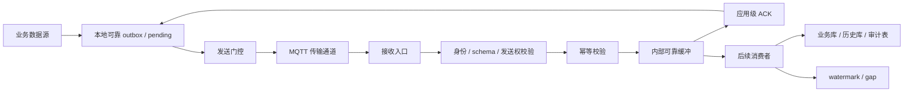
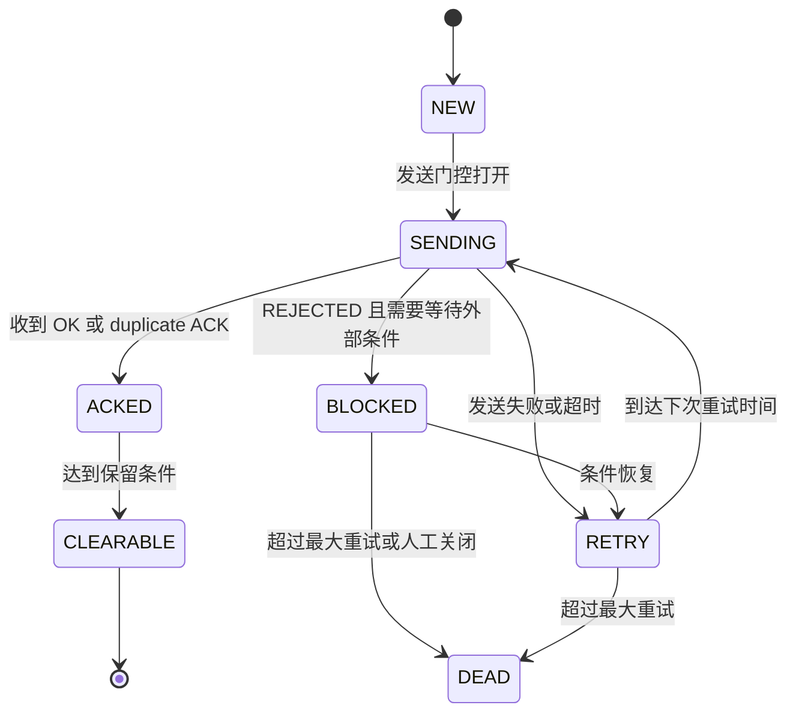
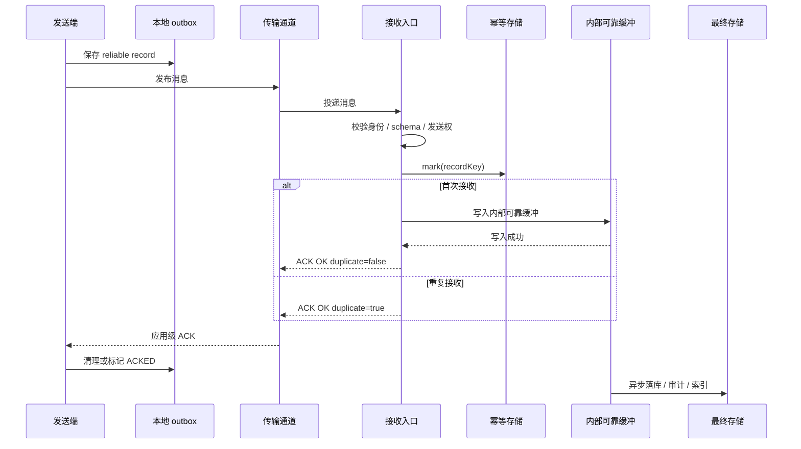
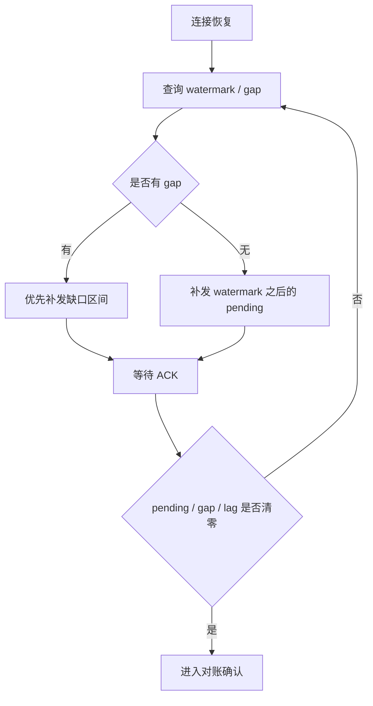

基于 MQTT 做数据同步时，一个常见误区是把“传输层已经收到”当成“业务数据已经完整同步”。

MQTT 适合做弱网长连接、Topic 路由、QoS 投递和会话恢复，但这些能力仍然属于传输层。如果数据只是刷新实时页面，丢一两条也许可以接受；但只要它未来要查历史、做报表、跑分析、审计追溯，或者承载状态生命周期，就不能只依赖连接恢复、自动重试和传输层确认。真正要保证的是：这条业务数据在发送端有事实源，在接收端只处理一次，断网后能补齐，最终能被对账证明。

这篇文章整理的是一个基于 MQTT 的可靠同步模型。重点不是 MQTT 客户端怎么接入，而是当 MQTT 只负责投递时，业务完整性应该如何由本地 pending、应用级 ACK、接收端幂等、watermark 和最终对账共同保证。

## 先区分可靠流和实时流

同步系统里不要一上来就讨论“怎么发”。第一步应该先判断：这类数据到底需不需要补齐。

| 类型 | 典型用途 | ACK | 补发 | 完整性口径 |
|---|---|---:|---:|---|
| `SCHEMA_RELIABLE` | 字段定义、设备定义、版本信息 | 是 | 是 | 被历史数据引用过的版本必须能查到 |
| `HISTORY_RELIABLE` | 采样历史、报表、分析、追溯数据 | 是 | 是 | 断网、重启、切换后最终补齐 |
| `EVENT_RELIABLE` | 生命周期事件、状态变更、确认记录 | 是 | 是 | 最终状态和必要过程完整 |
| `RT_ONLY` | 实时看板、调试值、临时状态 | 否 | 否 | 尽力到达，不承诺历史完整 |

如果某类数据既要实时展示，又要历史完整，通常只发送一份可靠流。接收端完成入库或进入内部缓冲后，再更新实时缓存。不要额外再发一份独立的实时流，否则很容易出现“页面看到一套、历史库又是一套”的口径分裂。

## 总体模型

一个可靠同步链路可以抽象成下面这样。



这里有两个关键点。

第一，发送端先写本地可靠 outbox，再尝试发送。没有收到应用级 ACK 前，记录不能删除。断网、进程重启、发送失败，都只是让记录继续留在 pending 状态。

第二，接收端不能刚收到传输消息就回成功 ACK。它至少要完成必要校验、幂等判断，并把消息写入自己的可靠边界。这个边界可以是数据库 outbox、持久化日志、消息队列或其他可恢复的缓冲。ACK 表示“接收端已经接管这条同步记录”，不表示所有下游副作用已经完成。

## 消息需要稳定身份

可靠同步最怕的是重试一次就变成另一条数据。发送端必须在数据进入 outbox 时生成稳定身份，而不是在发送线程里临时拼。

一个简化后的可靠消息可以长这样：

```json
{
  "header": {
    "messageId": "msg-20260602-000001",
    "streamClass": "HISTORY_RELIABLE",
    "streamKey": "asset-001:telemetry",
    "recordKey": "asset-001:telemetry:0001024",
    "captureSeq": 1024,
    "schemaId": "schema-telemetry-v3",
    "schemaVersion": 3,
    "eventTime": 1780374600000,
    "sendAttempt": 1
  },
  "body": {
    "deviceCode": "device-001",
    "values": {
      "101": 82.5,
      "102": 37.8,
      "103": 1450
    }
  }
}
```

几个字段分工要分清：

| 字段 | 用途 |
|---|---|
| `messageId` | 传输消息 ID，每次重发可以不同，用于 ACK 定位和日志排查 |
| `recordKey` | 业务幂等键，同一条真实业务数据重发时必须一致 |
| `captureSeq` | 采集序列号，用于连续水位、缺口检测和补发范围 |
| `streamClass` | 标识可靠流类型，用来决定是否 ACK、是否补发 |
| `streamKey` | 标识同一条连续流，例如某个对象的某类历史数据 |
| `schemaId` | 标识数据解码依赖的结构版本 |

幂等靠 `recordKey`，连续完整靠 `captureSeq`，传输排查靠 `messageId`。把这三个概念混在一起，后面补发、去重和对账都会变得含糊。

## ACK 到底确认什么

应用级 ACK 应该由接收端统一发送，而不是散落在各个业务 handler 里。

一条成功 ACK 可以包含这些信息：

```json
{
  "ackMessageId": "msg-20260602-000001",
  "status": "OK",
  "reason": null,
  "streamClass": "HISTORY_RELIABLE",
  "streamKey": "asset-001:telemetry",
  "acceptedWatermark": 1024,
  "acceptedRecordCount": 1,
  "duplicate": false,
  "serverTime": 1780374600300
}
```

`status = OK` 表示接收端已经通过校验，并且消息已经进入接收端可靠边界。`duplicate = true` 也可以视为成功，因为它说明这条业务数据已经处理过，发送端可以清理本地 pending。

失败 ACK 不应该清理 pending：

```json
{
  "ackMessageId": "msg-20260602-000001",
  "status": "REJECTED",
  "reason": "SCHEMA_NOT_FOUND",
  "streamClass": "HISTORY_RELIABLE",
  "streamKey": "asset-001:telemetry",
  "acceptedWatermark": 1023,
  "duplicate": false,
  "serverTime": 1780374600300
}
```

例如 schema 缺失、身份不匹配、发送权过期、字段校验失败，都不应该让发送端误以为同步完成。发送端收到 `REJECTED` 后可以继续保留 pending，等待补 schema、刷新发送权，或进入人工处理队列。

## 发送端 pending 状态机

发送端的 pending 不是内存列表，而是可靠事实源。它至少要记录消息内容、ACK 状态、重试次数、下次重试时间和失败原因。



这里的“发送门控”可以很简单，也可以很复杂。简单场景下，它只判断网络是否可用；如果同一数据源存在多个发送节点，它还需要判断当前节点是否持有发送权。无论哪种实现，门控关闭时都不能丢 pending，只是暂停发送。

## 一次正常同步的时序



如果 ACK 没回来，发送端不需要判断“到底是消息没到，还是 ACK 丢了”。它只要继续保留 pending 并重放。接收端靠 `recordKey` 去重，重复消息只回成功 ACK，不重复触发业务副作用。

## watermark 只代表连续完整

`watermark` 不是“接收过的最大序号”，而是“已经连续确认到的最大序号”。

比如接收端已经收到 `100、101、104`：

```json
{
  "received": [100, 101, 104],
  "acceptedWatermark": 101,
  "gapRanges": [
    {
      "from": 102,
      "to": 103
    }
  ]
}
```

`104` 可以先进入内部缓冲，甚至先被后续消费者处理，但它不能推动连续水位。只有 `102、103` 补齐后，watermark 才能继续向前推进。

断网恢复时，发送端不应该只从“最新位置”继续发，而应该先查询接收端的 watermark 和 gap：



这里的 `lag` 指的是接收端内部缓冲之后的下游积压。只要还有积压、死信或 gap，就不能说最终存储已经一致。

## schema 缺失不要直接丢

弱网环境下，数据和 schema 到达顺序可能会乱。接收端收到一条历史数据，但找不到它引用的 schema，这时不能直接解码失败后丢弃。

更稳妥的做法是：

1. 把原始消息放入隔离队列，记录 `schemaId` 和失败原因。
2. 返回 `REJECTED` 或 `PENDING` ACK，提示发送端补发 schema。
3. schema 到达并保存后，按 `schemaId` 取出隔离消息重新处理。
4. 重新处理仍然走同一套校验、幂等和 ACK 逻辑。

这样可以避免“历史数据到了，但结构定义晚到一步”导致永久丢数据。

## 多节点发送要有中心裁决

如果同一数据源只会有一个发送节点，事情会简单很多。但在高可用场景下，两个节点可能都能采集、都能写本地 outbox，也都可能在网络抖动后认为自己应该发送。

这时不要只靠发送端自觉。更稳的边界是：

- 中心端签发发送租约。
- 租约每次切换递增 `epoch`。
- 可靠数据携带不可伪造的发送权 token。
- 接收入口只接受当前 token，旧 token 消息返回 `REJECTED`。
- 发送端收到旧 token 拒绝后关闭发送门控，但保留未 ACK pending。

这套机制的目标不是阻止短暂双发，而是让接收端能确定性拒绝旧发送者。短暂双发可以接受，旧数据进入可靠链路不可接受。

## 最终一致性怎么验收

弱网同步不能靠“日志看起来恢复了”验收。至少要同时看几类证据：

| 检查项 | 通过标准 |
|---|---|
| 发送端 pending | 未 ACK 的可靠记录清零，或剩余记录进入可审计的 dead letter |
| 接收端 watermark | 每个可靠 stream 都推进到预期水位 |
| gap | 缺口为空 |
| 内部缓冲 lag | 下游消费者追平，死信为空或已闭环 |
| 最终存储 | 发送端可靠源与接收端业务表对账差异为 0 |
| 幂等记录 | 重放和重复投递不会产生重复副作用 |

如果其中一项没过，只能说明链路还在恢复，或者某个环节阻塞。尤其是 ACK 只代表接收端接管了同步记录，不代表最终业务库已经追平。

## 小结

弱网可靠同步的核心不是选哪种传输协议，而是把完整性责任拆清楚：

- 发送端先写可靠 outbox，ACK 前不删除 pending。
- 传输层只负责投递，不负责业务完整。
- 接收端完成校验、幂等和可靠接管后才回应用级 ACK。
- `recordKey` 负责去重，`captureSeq` 和 watermark 负责证明连续完整。
- schema 缺失、发送权过期、下游失败都要有明确的拒绝、隔离或重试路径。
- 最终一致性要靠 pending、watermark、gap、lag 和业务表对账一起证明。

只要这些边界建立起来，传输通道可以替换，存储实现可以替换，业务类型也可以继续扩展。否则系统看起来在同步，实际上只是把丢数据、重复数据和恢复不完整的问题推迟到了对账那一天。
